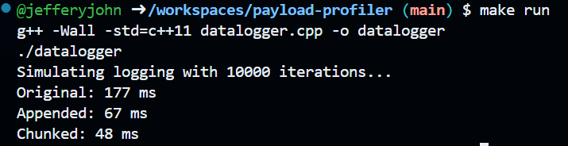
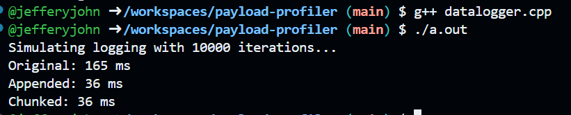
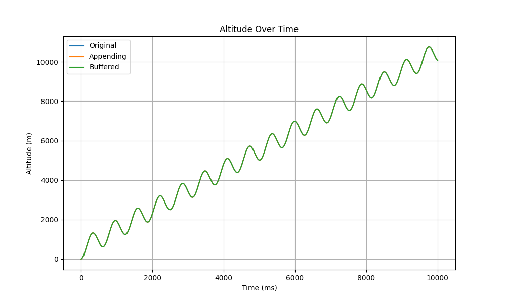
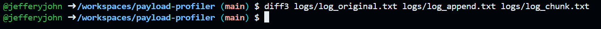

# payload-profiler

CMRC's USLI 2025 competition rocket, THISTLE, encountered data loss after an unanticipated lithobraking manuever. 

To improve resiliency and data fidelity, this prototype profiles different methods of i/o operations for future payloads.

## Theory

* Open / closing SD cards is slow

* Rapid read / write operations wear out SD cards

* High vibration environments can lead to the SD card mechanically disconnecting, resulting in data loss

* By appending data, we can reduce input / output operations, as the SD card file would remain open

* By chunking data, we can reduce input / output operations, but risk losing more data if interrupted

* By switching to chars instead of Strings, we can use C++ optimizations

For the purposes of this demo, I'm treating C++ as Arduino, avoiding the need to run on hardware (though we should)

## Development

`make run`

Alternatively:

`g++ datalogger.cpp`

`./a.out`

The program should generate mock sensor data from our STEMnauts, time each approach, and output performance stats.

To visualize the difference in a `chart.png`:

`pip install -r requirements.txt`

`python3 visualize.py`

You can also use `diff3 logs/log_append.txt logs/log_chunk.txt logs/log_original.txt`, or standard `diff` for any two files with `diff [x] [y]`.

To reset, `make clean`

## Future State

These optimizations seem to maintain data fidelity in nominal software conditions - though testing is needed in a launch environment. 

If hardware is finalized, it would be more secure to design for writing to flash memory. We could also use an ACID compliant database like SQLite, 
but that might be a bit of a square peg round hole situation. If we do more time series, our ground station could benefit from InfluxDB or similar. 